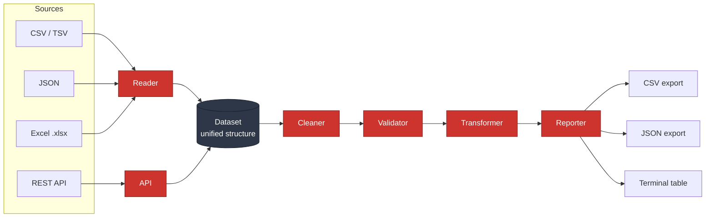
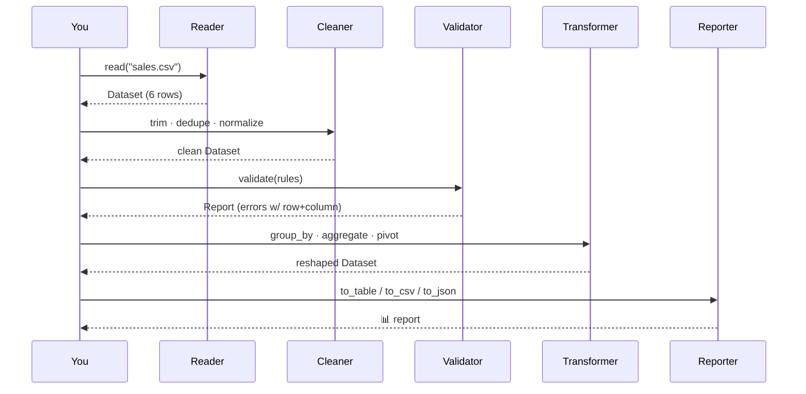

<div align="center">

# 🧮 DataCruncher

### A batteries-included Ruby toolkit for reading, cleaning, validating, transforming and reporting on tabular data.

*Read anything → clean it → validate it → reshape it → ship a report.*

<br />

[](https://github.com/sja-thedude/DataCruncher/actions/workflows/ci.yml)
[](https://github.com/sja-thedude/DataCruncher)
[](https://www.ruby-lang.org)
[](LICENSE)
[](https://github.com/rubocop/rubocop)
[](spec/)
[](#-contributing)

</div>

---

## 📚 Table of Contents

- [Why DataCruncher?](#-why-datacruncher)
- [Architecture](#-architecture)
- [The Data Pipeline](#-the-data-pipeline)
- [Installation](#-installation)
- [Quick Start](#-quick-start)
- [Core Modules](#-core-modules)
  - [Reader](#1️⃣-reader--read-anything)
  - [Cleaner](#2️⃣-cleaner--tidy-it-up)
  - [Validator](#3️⃣-validator--trust-but-verify)
  - [Transformer](#4️⃣-transformer--reshape-and-aggregate)
  - [Reporter](#5️⃣-reporter--ship-the-results)
  - [API](#6️⃣-api--pull-in-remote-data)
- [Command-Line Interface](#-command-line-interface)
- [Real-World Examples](#-real-world-examples)
- [Development & Testing](#-development--testing)
- [Roadmap](#-roadmap)
- [Contributing](#-contributing)
- [License](#-license)

---

## ✨ Why DataCruncher?

Most data chores in Ruby end up as a tangle of one-off `CSV` scripts, ad-hoc
`Hash` munging and copy-pasted validation. **DataCruncher** gives you one
coherent toolkit and one in-memory structure — the [`Dataset`](lib/data_cruncher/dataset.rb) —
that flows cleanly through every stage.

| | Feature | What you get |
|---|---|---|
| 📥 | **Read anything** | CSV, TSV, JSON and Excel (`.xlsx`) into one unified `Dataset` |
| 🧹 | **Clean it** | De-dupe, fill / drop / interpolate missing values, trim, coerce types, normalize dates · emails · phones |
| ✅ | **Validate it** | A declarative rule DSL with **row & column-level error reports** |
| 🔀 | **Transform it** | Filter, sort, group, aggregate, **pivot tables** and SQL-style **joins** |
| 🌐 | **Fetch it** | Pull JSON from any REST API and merge it with local data |
| 📊 | **Report it** | Export to CSV, JSON, or a polished **terminal table** |
| 💻 | **Automate it** | A full-featured `datacruncher` CLI for the whole pipeline |

- **Zero heavy runtime dependencies** — built on the standard library plus
  [`terminal-table`](https://github.com/tj/terminal-table) and
  [`rubyXL`](https://github.com/weshatheleopard/rubyXL).
- **Chainable & immutable-friendly** — the `Cleaner` and `Transformer` never
  mutate your source data.
- **Tested** — 74 RSpec examples and a green RuboCop run on Ruby 3.1 → 3.4.

---

## 🏗 Architecture



Every module speaks the same language — a `Dataset` is just an ordered list of
**headers** plus an array of **rows** (each a `Hash` keyed by column name), so
the output of any stage is valid input to the next.

---

## 🔄 The Data Pipeline



---

## 📦 Installation

Add it to your `Gemfile`:

```ruby
gem "data-cruncher"
```

Then:

```bash
bundle install
```

Or install it directly:

```bash
gem install data-cruncher
```

Require it in code (both spellings work):

```ruby
require "data_cruncher"   # matches the module
# or
require "data-cruncher"   # matches the gem name
```

> **Requirements:** Ruby >= 3.0.

---

## 🚀 Quick Start

```ruby
require "data_cruncher"

# 1. Read a file into a unified Dataset
sales = DataCruncher.read("sales.csv")

# 2. Clean it (chainable, never mutates the source)
clean = DataCruncher::Cleaner.new(sales)
  .trim_whitespace
  .remove_duplicates
  .coerce_types("amount" => :float, "quantity" => :integer)
  .result

# 3. Validate it
report = DataCruncher::Validator.new do
  required :region, :product
  range :amount, min: 0
end.validate(clean)

puts report.valid? ? "✅ data is clean" : report

# 4. Transform it
summary = DataCruncher::Transformer.new(clean)
  .aggregate(group_by: "region", sum: "amount", avg: "amount", count: true)

# 5. Report it
puts DataCruncher::Reporter.to_table(summary, title: "Sales by Region")
```

```text
+------------------------------------------+
|             Sales by Region              |
+--------+-------+------------+------------+
| region | count | sum_amount | avg_amount |
+--------+-------+------------+------------+
| West   | 3     | 2250.75    | 750.25     |
| East   | 2     | 2300.75    | 1150.375   |
| North  | 1     | 300.0      | 300.0      |
+--------+-------+------------+------------+
```

---

## 🧩 Core Modules

### 1️⃣ Reader — *read anything*

Auto-detects the format from the file extension (override with `format:`).

```ruby
DataCruncher::Reader.read("customers.csv")              # CSV
DataCruncher::Reader.read("export.txt", format: :tsv)   # TSV
DataCruncher::Reader.read("users.json", root: "data")   # JSON (nested array)
DataCruncher::Reader.read("report.xlsx")                # Excel (.xlsx)
```

| Format | Extensions | Notes |
|---|---|---|
| CSV | `.csv` | headers from the first row |
| TSV | `.tsv`, `.txt` | tab-separated |
| JSON | `.json` | bare array, wrapper object, or single object |
| Excel | `.xlsx`, `.xlsm` | reads the first worksheet (or pass `sheet:`) |

Everything returns a `Dataset`:

```ruby
data = DataCruncher::Reader.read("sales.csv")
data.headers          # => ["date", "region", "product", "amount", "quantity"]
data.size             # => 6
data.column("region") # => ["West", "East", "West", "North", "East", "West"]
data.first            # => {"date"=>"2026-01-05", "region"=>"West", ...}
```

### 2️⃣ Cleaner — *tidy it up*

Chainable, and works on a deep copy — your original `Dataset` is never touched.

```ruby
clean = DataCruncher::Cleaner.new(raw)
  .trim_whitespace                                       # strip stray spaces
  .remove_duplicates(columns: %w[name email])            # de-dupe by key cols
  .handle_missing(strategy: :fill, value: { "country" => "Unknown" })
  .handle_missing(strategy: :interpolate, columns: "revenue")
  .coerce_types("age" => :integer, "active" => :boolean)
  .normalize_emails(columns: "email")                    # ALICE@X.COM → alice@x.com
  .normalize_phones(columns: "phone")                    # 4155551234 → +1 (415) 555-1234
  .normalize_dates(columns: "signup_date")               # 01/20/2025 → 2025-01-20
  .result
```

| Missing-value strategy | Behaviour |
|---|---|
| `:drop` | remove rows with any blank value (in the chosen columns) |
| `:fill` | replace blanks with a scalar or a per-column `Hash` |
| `:interpolate` | linear interpolation between known numeric neighbours |

### 3️⃣ Validator — *trust, but verify*

A small declarative DSL that returns a detailed report — every failure carries
its **row index**, **column** and **rule**.

```ruby
validator = DataCruncher::Validator.new do
  required  :name, :email
  type      :age, :integer
  range     :age, min: 18, max: 99
  format    :email, :email                  # built-in :email/:url/:phone/:zip, or a Regexp
  inclusion :status, in: %w[active inactive]
  length    :name, min: 2, max: 60
  cross :salary_band do |row|               # cross-field / row-level rule
    "salary below band minimum" if row["salary"].to_f < row["band_min"].to_f
  end
end

report = validator.validate(employees)

report.valid?                 # => false
report.error_count            # => 4
report.errors_for_column("age")
report.errors_for_row(2)
report.to_h                   # machine-readable
report.to_json                # ship it to a dashboard
puts report                   # human-readable summary ↓
```

```text
4 validation error(s) across 4 row(s):
  - [row 1, column 'age'] must be >= 18
  - [row 2, column 'email'] has invalid format
  - [row 2, column 'status'] must be one of: active, inactive
  - [row 3, column 'name'] is required
```

### 4️⃣ Transformer — *reshape and aggregate*

Row/column operations are **chainable**; aggregating operations return a new `Dataset`.

```ruby
t = DataCruncher::Transformer.new(sales)

# Chainable filtering / sorting / projection
top = t.where("region" => "West")
       .sort_by("amount", direction: :desc)
       .select("product", "amount")
       .limit(5)
       .dataset

# Grouped aggregation: sum / avg / count / min / max
t.aggregate(group_by: "region", sum: "amount", avg: "amount", count: true)

# Pivot table
t.pivot(rows: "region", columns: "product", values: "amount", aggregate: :sum)

# SQL-style joins: :inner, :left, :right, :outer
DataCruncher::Transformer.new(orders).merge(customers, on: "customer_id", how: :left)
```

A pivot table, rendered:

```text
+---------------------------+
|     Region x Product      |
+--------+--------+---------+
| region | Gadget | Widget  |
+--------+--------+---------+
| West   | 450.25 | 1800.5  |
| East   | 800.0  | 1500.75 |
| North  |        | 300.0   |
+--------+--------+---------+
```

### 5️⃣ Reporter — *ship the results*

Three output formats. Each returns a `String`, or writes to disk when given a `path:`.

```ruby
DataCruncher::Reporter.to_csv(data, path: "out.csv")       # → "out.csv"
DataCruncher::Reporter.to_json(data, pretty: true)         # → JSON string
puts DataCruncher::Reporter.to_table(data, title: "Q1", limit: 20)

# Or dispatch dynamically:
DataCruncher::Reporter.render(data, format: :csv, path: "out.csv")
```

### 6️⃣ API — *pull in remote data*

Fetch JSON from any REST endpoint into a `Dataset`, then merge it with local data.

```ruby
# One-off fetch
users = DataCruncher::API.fetch("https://api.example.com/users", root: "data")

# Configured client (shared base URL + auth header)
client = DataCruncher::API.new(
  base_url: "https://api.example.com",
  headers:  { "Authorization" => "Bearer #{token}" }
)
orders = client.get("/orders", params: { since: "2026-01-01" })

# Enrich local records with a remote lookup
enriched = DataCruncher::API.merge(local_customers, remote_profiles, on: "id", how: :left)
```

---

## 💻 Command-Line Interface

The bundled `datacruncher` executable runs the whole pipeline from your shell.

```bash
datacruncher process input.csv --clean --validate --report table
```

```text
Usage: datacruncher process FILE [options]

Cleaning:
        --clean                      Run standard cleaning (trim, de-duplicate, drop missing)
        --trim / --dedupe / --drop-missing / --fill VALUE

Transform:
        --where COND                 Keep rows matching col=value (repeatable)
        --select COLS                Keep only these comma-separated columns
        --sort COL[:desc]            Sort by column
        --limit N                    Keep only the first N rows
        --group-by COL               Group rows for aggregation
        --count / --sum / --avg / --min / --max COLS

Validate:
        --validate                   Validate the data
        --rules FILE                 Ruby file describing validation rules
        --strict                     Exit non-zero when validation fails

Report:
        --report FORMAT              csv, json or table (default: table)
    -o, --output FILE                Write the report to FILE instead of stdout
        --title TITLE                Title for the terminal table
```

**Examples:**

```bash
# Clean a customer list and keep two columns as CSV
datacruncher process customers.csv --clean --select name,email --report csv -o clean.csv

# Aggregate sales by region into a CSV summary
datacruncher process sales.csv --group-by region --sum amount --count --report csv -o summary.csv

# Validate employees against a rules file and fail the build if invalid
datacruncher process employees.json --validate --rules rules.rb --strict
```

A `--rules` file is plain Ruby evaluated in the Validator DSL:

```ruby
# rules.rb
required :name, :email
range :age, min: 18, max: 99
format :email, :email
inclusion :status, in: %w[active inactive]
```

> **Supported report formats:** `csv`, `json`, `table`. (The Reporter focuses on
> these three; passing an unsupported format prints a friendly error.)

---

## 🌍 Real-World Examples

### 💰 Processing sales data

> *Read raw sales, total revenue per region, and print a ranked report.*

```ruby
require "data_cruncher"

sales = DataCruncher.read("sales.csv")

summary = DataCruncher::Transformer.new(sales)
  .aggregate(group_by: "region", sum: "amount", avg: "amount", count: true)

ranked = DataCruncher::Transformer.new(summary)
  .sort_by("sum_amount", direction: :desc)
  .dataset

puts DataCruncher::Reporter.to_table(ranked, title: "Revenue by Region")
DataCruncher::Reporter.to_csv(ranked, path: "revenue_by_region.csv")
```

### 🧹 Cleaning a customer list

> *A messy export — stray whitespace, duplicate rows, mixed-case emails,
> inconsistent phone and date formats — turned into clean, deduplicated data.*

```ruby
require "data_cruncher"

raw = DataCruncher.read("customers.csv")

clean = DataCruncher::Cleaner.new(raw)
  .trim_whitespace
  .remove_duplicates(columns: %w[name email])
  .handle_missing(strategy: :fill, value: { "country" => "Unknown" })
  .normalize_emails(columns: "email")
  .normalize_phones(columns: "phone")
  .normalize_dates(columns: "signup_date")
  .coerce_types("id" => :integer)
  .result

DataCruncher::Reporter.to_json(clean, path: "customers.clean.json")
puts "Cleaned #{raw.size} → #{clean.size} rows"
```

### 👔 Validating employee records

> *Enforce business rules and produce an auditable error report.*

```ruby
require "data_cruncher"

employees = DataCruncher.read("employees.json")

rules = DataCruncher::Validator.new do
  required  :name, :email, :department
  type      :age, :integer
  range     :age, min: 18, max: 70
  format    :email, :email
  inclusion :status, in: %w[active inactive on_leave]
  range     :salary, min: 30_000
end

report = rules.validate(employees)

if report.valid?
  puts "✅ All #{report.row_count} employee records are valid."
else
  warn report                                            # human-readable
  File.write("validation_errors.json", report.to_json)   # machine-readable
  exit 1
end
```

---

## 🧪 Development & Testing

```bash
git clone https://github.com/sja-thedude/DataCruncher.git
cd DataCruncher
bundle install

bundle exec rspec      # run the test suite (74 examples)
bundle exec rubocop    # lint
bundle exec rake       # default: run the specs
```

The suite covers every module, including a generated Excel fixture and
fully-stubbed API requests (via [WebMock](https://github.com/bblimke/webmock)) —
no network access required.

```text
spec/
├── dataset_spec.rb       reader_spec.rb       cleaner_spec.rb
├── validator_spec.rb     transformer_spec.rb  reporter_spec.rb
├── api_spec.rb           cli_spec.rb
└── fixtures/             sales.csv · customers.csv · employees.json · scores.tsv
```

Continuous integration runs the specs on **Ruby 3.1, 3.2, 3.3 and 3.4** plus
RuboCop on every push and pull request — see
[`.github/workflows/ci.yml`](.github/workflows/ci.yml).

---

## 🗺 Roadmap

- [ ] Streaming reader for very large files
- [ ] Additional export formats (Markdown, HTML, XLSX writer)
- [ ] Pluggable custom normalizers
- [ ] Parallel transforms for big datasets

---

## 🤝 Contributing

Bug reports and pull requests are welcome on
[GitHub](https://github.com/sja-thedude/DataCruncher).

1. Fork the repository
2. Create your feature branch (`git checkout -b feature/my-feature`)
3. Add tests and make sure `bundle exec rspec` and `bundle exec rubocop` pass
4. Commit and open a pull request

---

## 📄 License

Released under the [MIT License](LICENSE). © 2026 Syeda Juveria Afreen.

<div align="center">
<sub>Built with ❤️ and Ruby.</sub>
</div>
